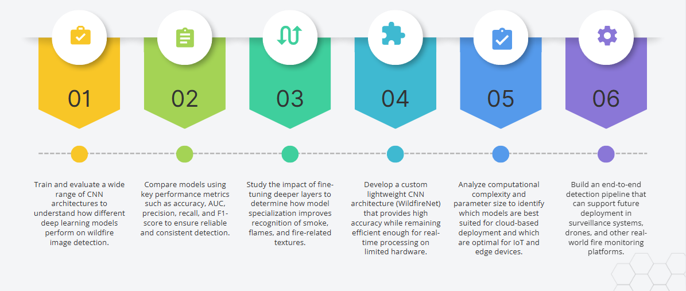
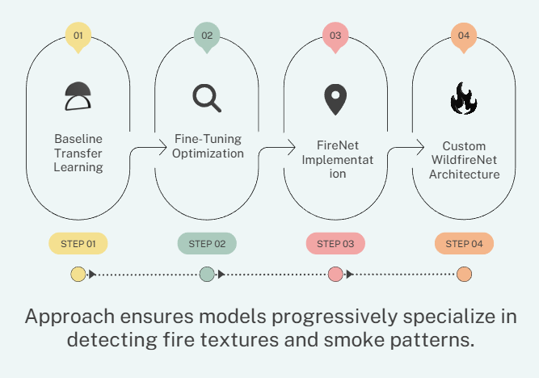
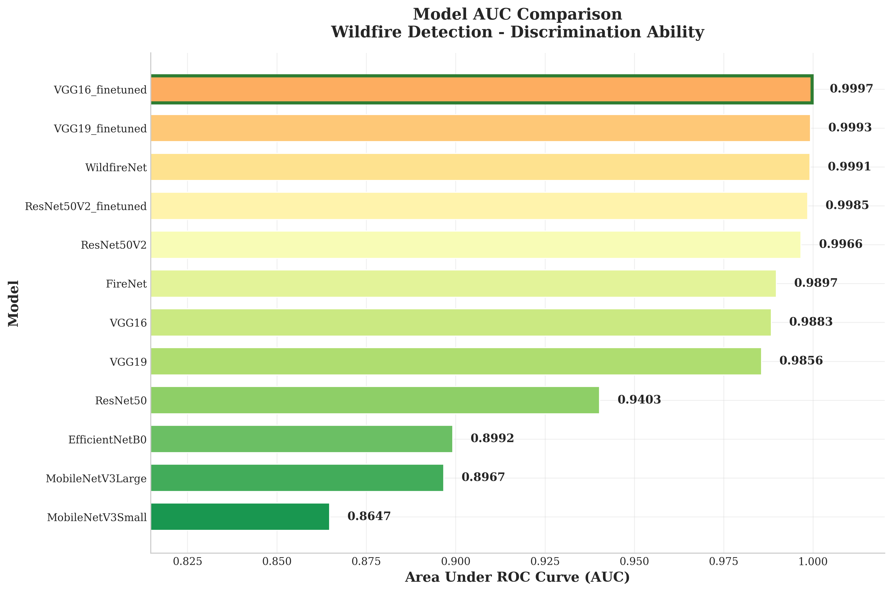
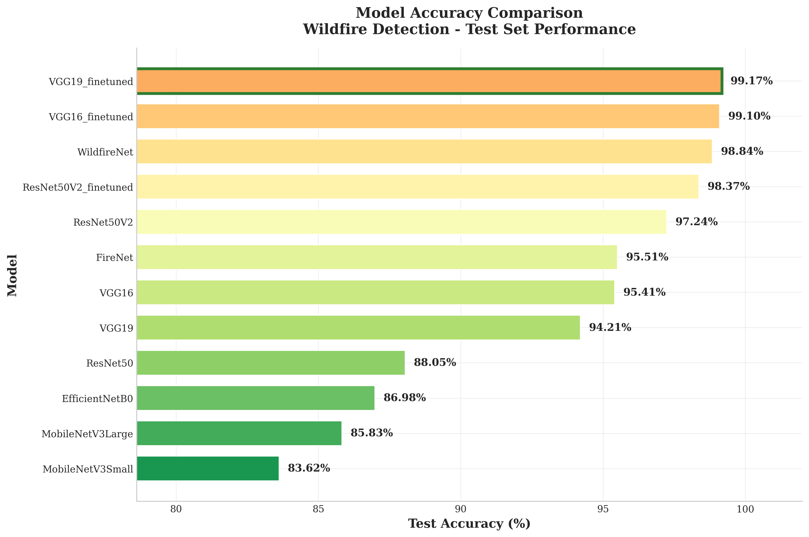
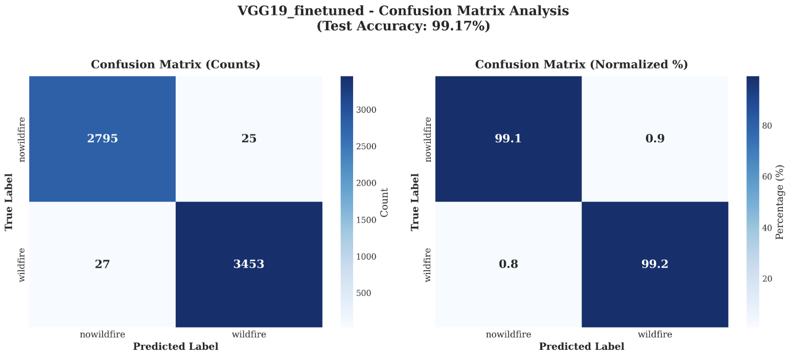

# Wildfire Detection System

KJ Somaiya School Of Engineering  
**Date:** 27 November 2025  

**Team:**  
- Hitanshi Patil - 16010122283  
- Harikrishnan Gopal - 16010122284  
- Maurya Ghogare - 16010122285  
- Sanika Pendurkar - 16010122286  

**Guide:** Ms. Kirti Mishra  

---

## Table of Contents

1. [Introduction](#introduction)  
2. [Problem Statement](#problem-statement)  
3. [Motivation](#motivation)  
4. [Research Gap](#research-gap)  
5. [Objectives](#objectives)  
6. [Dataset Description](#dataset-description)  
7. [Methodology](#methodology)  
   - [Stage 1: Baseline Transfer Learning](#stage-1-baseline-transfer-learning)  
   - [Stage 2: Fine-Tuning](#stage-2-fine-tuning)  
   - [Stage 3: FireNet Architecture](#stage-3-firenet-architecture)  
   - [Stage 4: WildfireNet (Custom Model)](#stage-4-wildfirenet-custom-model)  
8. [Comparative Performance](#comparative-performance)  
9. [Key Insights](#key-insights)  
10. [System Applications](#system-applications)  
11. [Future Improvements](#future-improvements)  
12. [Summary](#summary)  
13. [Conclusion](#conclusion)  
14. [References](#references)  

---

## Introduction

Wildfires cause large scale destruction to forests, wildlife habitats, property, and human life, which makes early detection critical. Rising temperatures and dry conditions have increased both the frequency and severity of wildfire incidents.

Traditional detection methods such as human observation and satellite monitoring are:
- Slow and often delayed  
- Inconsistent and prone to human error  
- Limited in coverage, especially in remote areas  

Many forest regions have no constant supervision, which allows fires to spread unnoticed. An automated detection system can enable faster response, lower damage, and reduced firefighting cost.

---

## Problem Statement

Manual wildfire monitoring is:
- Inconsistent and slow  
- Dependent on human availability and judgment  

Visual signals like smoke and flames vary heavily in:
- Shape  
- Color  
- Density  
- Movement  

Environmental factors like fog, clouds, sunlight, and shadows create confusion, leading to:
- False alarms  
- Missed detections  

Remote forested regions often lack continuous surveillance. There is a need for an automated system that can perform early and accurate fire detection in real world, noisy conditions.

---

## Motivation

In India, states such as Uttarakhand, Himachal Pradesh, Odisha, and the North East frequently experience forest fires.

- Over half of India’s forest area is fire prone.  
- Terrain is often hilly and remote, which makes manual monitoring difficult and slow.  
- Satellite alerts can be delayed or miss small fires due to cloud cover and low revisit frequency.  

An AI based detection system enables:
- Real time monitoring  
- Faster alerts  
- Better protection of forests, wildlife, and communities  

---

## Research Gap

Current literature shows clear gaps:

- High parameter models (for example U Net variants with 8–40M parameters, AlexNet with ~60M) achieve good accuracy but are not suitable for low memory or embedded hardware.  
- IoT based systems often rely only on simple dense networks and avoid image based detection because conventional CNNs are computationally heavy.  
- Most research focuses on accuracy only and ignores:
  - Lightweight architecture design  
  - Model compression  
  - Edge device compatibility  

For wildfire detection, factors like latency, power consumption, inference speed, and model size are as critical as accuracy. These constraints are largely unaddressed in past work.

---

## Objectives

The main objectives of this project are:

- Design and evaluate deep learning models for wildfire image classification.  
- Compare pretrained transfer learning models with a custom architecture.  
- Achieve high accuracy while keeping the model lightweight and suitable for edge deployment.  
- Analyze the tradeoffs between accuracy and efficiency for different architectures.  

---

## Dataset Description

The dataset consists of a diverse collection of **fire** and **non fire** images captured under various environmental and lighting conditions.

**Fire images include:**
- Clear flames  
- Dense smoke  
- Light smoke trails  
- Mixed scenes with both smoke and flame  

**Non fire images include:**
- Forest landscapes  
- Cloudy skies and foggy scenes  
- Sunlight reflections and glare  
- Vegetation that may visually resemble smoke  

Key challenge:  
Smoke is amorphous and can look similar to fog, mist, haze, or clouds. Flames vary in size, shape, color, and intensity. Backgrounds and lighting change significantly across images, which makes classification non trivial.

---

## Methodology

The training pipeline is divided into four stages:

1. Baseline transfer learning  
2. Fine tuning of top models  
3. Implementation of FireNet architecture  
4. Design of a custom lightweight model, WildfireNet  

---

### Stage 1: Baseline Transfer Learning

Pretrained ImageNet models were used to quickly obtain a baseline for wildfire detection.  
In this stage:

- All convolution layers were **frozen**.  
- Only the final classification head was trained.  

Goal: reuse generic visual features such as edges, textures, and shapes learned from large scale datasets.

Models evaluated:
- VGG16, VGG19  
- ResNet50, ResNet50V2  
- EfficientNetB0  
- MobileNetV3 Small and MobileNetV3 Large  

**Observation:**  
Transfer learning alone was not sufficient. Most models achieved less than 96 percent accuracy and struggled with wildfire specific variations such as:
- Different smoke densities  
- Irregular flame shapes  
- Confusing elements like fog, clouds, and glare  

This indicated the need for deeper specialization via fine tuning.

---

### Stage 2: Fine-Tuning

Based on Stage 1, the top three performers were selected:

- VGG16  
- VGG19  
- ResNet50V2  

For each of these:
- The **top 20 layers** were unfrozen.  
- A **lower learning rate** was used to prevent catastrophic forgetting.  

Fine tuning allowed the models to learn wildfire specific patterns such as:
- Smoke gradients and transparency levels  
- Flame color variations  
- Subtle texture distortions in fire regions  

**Impact:**

- VGG19 improved from **94.21 percent** to **99.17 percent** accuracy.  
- VGG16 improved from **95.41 percent** to **99.10 percent** accuracy.  

Fine tuned models became highly sensitive to:
- Low contrast smoke  
- Small and early stage flames  

---

### Stage 3: FireNet Architecture

FireNet was implemented based on the FireNet CNN research paper, designed specifically for wildfire image analysis.

Key properties:
- Custom **5 block convolutional** architecture  
- Input resolution of **150 x 150**, balancing detail and computation  
- Around **6.5M parameters**, which is moderately lightweight compared to VGG type models  

FireNet served as a specialized benchmark to compare:
- Generic pretrained models  
- Versus wildfire specific CNN designs  

---

### Stage 4: WildfireNet (Custom Model)

WildfireNet is a **custom CNN** designed from scratch to achieve high performance with strong efficiency.

Core design choices:
- **Residual connections** to improve gradient flow and prevent vanishing gradients during training.  
- **Channel attention module** to focus on important color cues and intensity variations associated with smoke and fire.  
- **Spatial attention module** to highlight the exact regions where fire or smoke patterns occur.  

Model size:
- Around **5.1M parameters**, which makes it extremely suitable for:
  - IoT devices  
  - Drones  
  - Surveillance cameras  
  - Real time edge deployment  

Despite being lightweight, WildfireNet outperforms EfficientNet and MobileNet variants on wildfire detection.

---

## Comparative Performance

Total of **12 models** were evaluated and ranked by accuracy:

- **VGG19 (fine tuned)** - 99.17 percent  
- **VGG16 (fine tuned)** - 99.10 percent  
- **WildfireNet (custom)** - 98.84 percent  
- **ResNet50V2 (fine tuned)** - 98.37 percent  
- Lowest performer: **MobileNetV3 Small** - 83.62 percent  

Result:  
Fine tuned deep models and the custom architecture outperform standard lightweight networks that were not tailored to wildfire imagery.

---

## Key Insights

### Performance Metrics

The following metrics were used:

- **Accuracy** - overall correctness  
- **AUC** - ability to distinguish fire vs non fire  
- **F1 score** - balanced combination of precision and recall  
- **Precision** - how many predicted fires were actually fire  
- **Recall** - how many real fires were correctly detected  

High recall is especially important, because missing a real fire is more dangerous than triggering a false alarm.

### VGG19 Fine Tuned - Best Performer

- Accuracy: **99.17 percent**  
- AUC: **0.9993**  
- F1 score: **0.9917**  

Strengths:
- Very deep architecture captures fine smoke and flame details.  
- Fine tuning adapts deeper layers to wildfire textures and color gradients.  

Limitation:
- Extremely heavy model (~144M parameters)  
- Not suitable for low power or real time edge deployment  

### WildfireNet Performance

- Accuracy: **98.84 percent**  
- AUC: **0.9991**  
- F1 score: **0.9883**  
- Size: **~5.1M parameters**  

WildfireNet:
- Outperforms EfficientNet and MobileNet on wildfire detection.  
- Is around **28x smaller** than VGG19 while achieving similar accuracy.  
- Provides an excellent balance between performance and efficiency.

### Why Generic Lightweight Models Struggled

Models like MobileNetV3 and EfficientNetB0 only reached around 83 to 86 percent accuracy.

Reasons:
- Depthwise separable convolutions, while efficient, often fail to capture irregular and fuzzy smoke shapes.  
- Aggressive feature map compression causes loss of critical color and texture details.  
- Lack of attention mechanisms limits their ability to focus on the actual fire or smoke regions.  

Wildfire detection requires specialized architectures rather than generic lightweight models.

### Efficiency vs Accuracy Tradeoff

- **VGG19 (fine tuned)**: highest accuracy but very heavy and slow for edge devices.  
- **WildfireNet**: near VGG level accuracy with a tiny parameter count and much faster inference.  

Deployment choice depends heavily on available compute:

- Cloud servers or high performance GPUs: use **VGG19 fine tuned**.  
- IoT cameras, drones, edge devices: use **WildfireNet**.  

---

## System Applications

This system can be integrated into:

- **Forest surveillance towers**  
  - Continuous automated monitoring of large forest regions.  

- **Drone based monitoring**  
  - Fast scanning of remote, hilly, or inaccessible areas.  

- **Smart city CCTV networks**  
  - Fire detection near urban forest boundaries, industrial zones, and public spaces.  

- **Remote IoT fire detectors**  
  - Low cost real time monitoring in rural and tribal regions with limited connectivity.  

- **Wildlife protection zones**  
  - Early alerts to protect habitats and reduce biodiversity loss during fire outbreaks.  

---

## Future Improvements

Planned directions:

- Extend to **real time video analysis** for continuous fire and smoke tracking.  
- Apply **on device optimization** such as:
  - Quantization  
  - Pruning  
  - TensorRT based acceleration  

- Explore **multimodal detection** by combining:
  - RGB images  
  - Thermal or infrared data  

- Expand the dataset with:
  - More diverse real world wildfire images  
  - Seasonal and vegetation variations  

- Integrate with **early warning platforms** to enable:
  - Fast alerts  
  - Automated emergency workflows  
  - Better communication with authorities  

---

## Summary

- Fine tuning improved accuracy by **3 to 5 percent**, making models far more sensitive to wildfire specific patterns.  
- VGG based models deliver the highest accuracy but are too large for portable or real time deployment.  
- The custom **WildfireNet** model delivers near state of the art accuracy in a highly compact form, ideal for edge devices.  
- Generic lightweight models such as MobileNet and EfficientNet struggle due to information loss and lack of attention modules.  
- Wildfire detection benefits significantly from specialized architectures instead of off the shelf generic networks.  

---

## Conclusion

Deep learning based image analysis provides a highly reliable approach for early wildfire detection.

The proposed **WildfireNet** architecture:
- Enables accurate, fast, and efficient on device inference.  
- Is suitable for real world deployment in fire management systems, drones, IoT networks, and surveillance infrastructure.  

Automated detection can reduce response time, limit fire spread, and minimize damage. With continued improvements and larger datasets, this system can be scaled to support wildfire monitoring at national and global levels.

---

## References

1. Illarionova et al., 2025 - “Exploration of geo spatial data and machine learning algorithms for robust wildfire occurrence prediction,” Scientific Reports, vol. 15, no. 10712, 2025.  
2. Ensemble based daily wildfire outbreak prediction in Korea, Scientific Reports, 2025.  
3. J. Deng, B. Hong, W. Wang, G. Gu - “Spatio temporal wildfire risk prediction using global local dependency deep learning (GLSTD),” Environmental Modelling, 2024.  
4. N. Fitzgerald, M. Seefried, F. Yost et al. - “Paying Attention to Wildfire: Using U Net with Attention Blocks on Multimodal Data for Next Day Prediction,” Proc. 25th ACM International Conference on Multimodal Interaction (ICMI '23), 2023.  
5. “An integrated machine learning and deep learning approach for wildfire prediction and detection using GUI,” Proc. Int. Conf. Intelligent Computing and Control Systems (ICICCS), IEEE, 2020.  
6. “WiPreSy: Wireless Prediction System for Forest Fires using IoT and Deep Learning,” Proc. Int. Conf. Intelligent Computing and Control Systems (ICICCS), IEEE, 2020.  
7. Y. Pang et al. - “Forest fire occurrence prediction in China based on machine learning methods,” Remote Sensing, vol. 14, no. 21, p. 5546, 2022.  
8. M. K. Al Bashiti, M. Z. Naser - “Machine learning for wildfire classification: Exploring blackbox, explainable, symbolic, and SMOTE methods,” Natural Hazards Research, vol. 2, no. 3, pp. 154–165, 2022.  
9. H. Naderpour, P. Rizeei, A. D. A. A. Shahabi, M. R. Mahiny - “Forest fire risk prediction: a spatial deep neural network based framework,” Remote Sensing, vol. 13, no. 15, 2021.  
10. S. Nami, S. M. Moghadam, A. H. Shamsoddini - “Spatial prediction of wildfire probability in the Hyrcanian ecoregion using evidential belief function model and GIS,” International Journal of Environmental Science and Technology, vol. 15, pp. 2015–2030, 2018.  

---

*Thank you for reading.*
